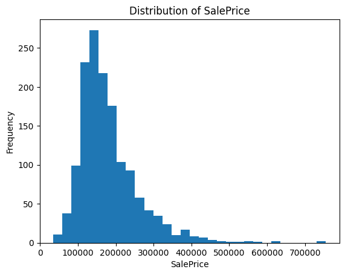
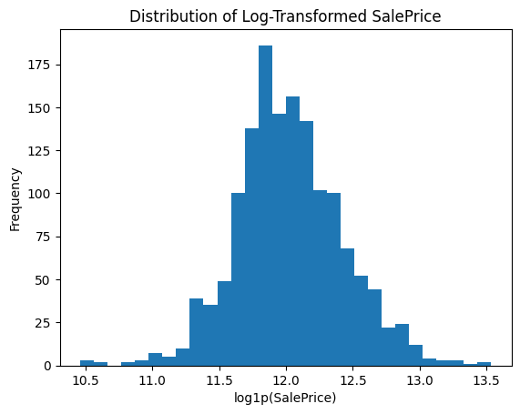
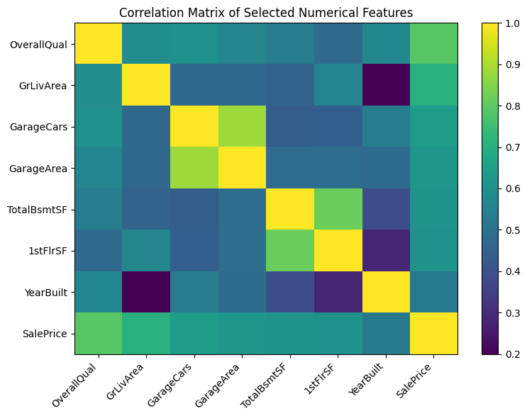
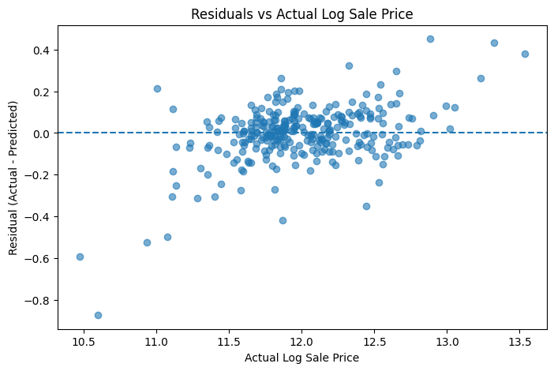
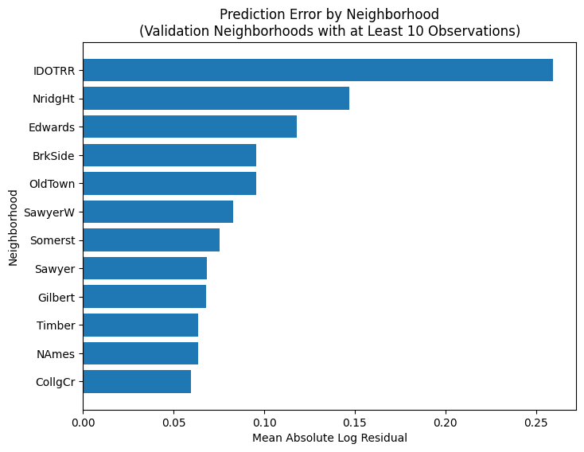

# House Price Prediction: From Linear Models to Gradient Boosting

An end-to-end machine learning project for residential house-price prediction using the Kaggle **House Prices: Advanced Regression Techniques** dataset.

Rather than focusing only on leaderboard performance, this project examines the complete data-science workflow: exploratory data analysis, missing-data investigation, preprocessing, regularisation, nonlinear modelling, cross-validation, error analysis, and final Kaggle submission.

## Project Highlights

- Analysed **1,460 labelled observations** with **79 predictors**
- Investigated structural and partial missingness in garage and basement variables
- Reclassified statistically categorical variables such as `MSSubClass`
- Reduced target skewness using `log1p(SalePrice)`
- Compared Linear Regression, Ridge Regression, Random Forest, and Gradient Boosting
- Selected hyperparameters using shuffled **5-fold cross-validation**
- Performed residual and neighbourhood-level error analysis
- Retrained the selected model on the complete training dataset
- Achieved a **Kaggle Public Leaderboard score of 0.13057**

## Dataset

The project uses the Kaggle House Prices dataset, which contains detailed information about residential properties in Ames, Iowa.

The training data contain:

- **1,460 observations**
- **81 original columns**
- `SalePrice` as the prediction target
- **79 predictors** after removing `SalePrice` and the identifier `Id`

The predictors include numerical, nominal categorical, ordinal, and identifier-type variables.

## Exploratory Data Analysis

Exploratory analysis identified several important characteristics of the data.

`SalePrice` is strongly right-skewed. Applying:

```python
np.log1p(SalePrice)
```

reduced training-target skewness from approximately **1.74** to **0.12**.
### Target Distribution

<p align="center">
  
  
</p>

The log transformation substantially reduces the strong right skew of the original target distribution, making the transformed target more suitable for RMSE-based modelling.

Several numerical variables showed relatively strong associations with house prices, including:

- `OverallQual`
- `GrLivArea`
- `GarageCars`
- `GarageArea`
- `TotalBsmtSF`
- `1stFlrSF`

The analysis also identified substantial correlation between some predictors. For example, `GarageCars` and `GarageArea` have a correlation of approximately **0.88**, motivating the evaluation of regularised regression.
### Feature Correlations

<p align="center">
  
</p>

The correlation matrix highlights several strongly related predictors. In particular, the high correlation between `GarageCars` and `GarageArea` illustrates potential multicollinearity in the feature space and provides additional motivation for evaluating regularised linear models.
## Missing-Value Analysis

Missing values were not treated as automatically equivalent.

The analysis showed that some missing values represent **structural absence** rather than unknown information. For example, all five selected garage-related categorical variables were simultaneously missing for **81 observations**, consistent with properties without garages.

Basement variables required more careful interpretation. While **37 observations** had all selected basement fields missing, two observations showed partial missingness despite having other evidence of an existing basement.

This demonstrated the importance of evaluating missingness using related variables and domain context rather than relying only on missing-value counts.

## Preprocessing

The final modelling pipeline uses separate preprocessing strategies for numerical and categorical variables.

### Numerical Features

- Median imputation

### Categorical Features

- Constant-value imputation using `Missing`
- One-hot encoding
- Unknown categories ignored during transformation

`MSSubClass`, although stored numerically in the raw dataset, is treated as categorical because its values represent dwelling classes rather than continuous quantities.

After preprocessing, the original **79 predictors expand to 315 model-ready features**.

## Model Development

Models were evaluated using RMSE on the log-transformed target.

| Model | Validation RMSE |
|---|---:|
| Tuned Gradient Boosting | **0.1363** |
| Ridge Regression | 0.1375 |
| Default Gradient Boosting | 0.1383 |
| Full-Feature Linear Regression | 0.1425 |
| Random Forest | 0.1456 |
| 3-Feature Linear Regression | 0.1872 |

### Linear Regression

A simple baseline model was first constructed using:

- `OverallQual`
- `GrLivArea`
- `YearBuilt`

This three-feature model achieved a validation RMSE of approximately **0.1872**.

Expanding the model to the complete preprocessed feature set reduced validation RMSE to approximately **0.1425**, demonstrating that useful predictive information is distributed across many property characteristics.

### Ridge Regression

Ridge regression was introduced to address correlated and redundant predictors in the expanded feature space.

Five `alpha` values were evaluated using shuffled 5-fold cross-validation.

The selected configuration was:

```text
alpha = 10
Mean CV RMSE = 0.1404
```

Ridge improved validation RMSE from **0.1425** for ordinary full-feature linear regression to **0.1375**.

### Random Forest

Random Forest was evaluated as a nonlinear ensemble alternative capable of capturing feature interactions and nonlinear relationships.

Under the evaluated configuration, Random Forest achieved a validation RMSE of approximately **0.1456**.

This result was weaker than Ridge regression, illustrating that greater model complexity does not automatically improve predictive performance.

### Gradient Boosting

Gradient Boosting was then evaluated as a sequential ensemble approach.

Six Gradient Boosting configurations were compared using the same shuffled 5-fold cross-validation strategy.

The selected hyperparameters were:

```text
n_estimators = 500
learning_rate = 0.03
max_depth = 3
```

This configuration achieved:

```text
Mean 5-fold CV RMSE = 0.1283
Validation RMSE     = 0.1363
```

The improvement over Ridge was modest, again illustrating that additional model complexity does not automatically produce large gains.

## Error Analysis

Model evaluation was extended beyond aggregate RMSE to investigate where the selected model made its largest errors.

Residuals were defined as:

```text
Residual = Actual Log Price - Predicted Log Price
```

Analysis of the largest errors suggested a tendency for some lower-priced properties to be overpredicted and some higher-priced properties to be underpredicted.

Across the complete validation set, actual log price and residual had a correlation of approximately **0.44**.

Because positive residuals indicate underprediction and negative residuals indicate overprediction, this pattern is consistent with a tendency toward the middle of the price distribution. However, the relationship is not deterministic and is not interpreted as evidence of a universal prediction pattern.
### Residual Diagnostics

<p align="center">
  
</p>

The residual plot shows a moderate positive relationship between actual log price and residuals. Some lower-priced properties are overpredicted, while some higher-priced properties are underpredicted. However, the pattern is not universal, so the figure is treated as diagnostic evidence rather than proof of a deterministic relationship.

### Neighbourhood-Level Error Analysis

Prediction error also varied across neighbourhoods.

Among neighbourhoods represented by at least 10 validation observations:

- `IDOTRR` had a mean absolute log residual of **0.2592**
- `IDOTRR` had a median absolute log residual of **0.1696**
- `NridgHt` had a mean absolute log residual of **0.1471**

The relatively high mean and median errors for `IDOTRR` suggest that its performance cannot be attributed solely to one extreme prediction.

For `NridgHt`, the difference between mean and median error suggests that several particularly large errors contribute to its overall error level.

These differences are descriptive rather than causal and may reflect differences in property characteristics, price distributions, feature interactions, and subgroup sample sizes.
<p align="center">
  
</p>

The figure compares mean absolute log residuals across neighbourhoods. `IDOTRR` shows the largest average prediction error among the evaluated groups, while several neighbourhoods have substantially lower errors. Because subgroup sizes differ, these results are used primarily to identify areas for further investigation rather than to make causal conclusions.
## Final Model and Kaggle Result

After model selection and error analysis, the tuned Gradient Boosting pipeline was retrained using all **1,460 labelled training observations**.

The final model generated predictions for all **1,459 Kaggle test observations**.

Final evaluation results were:

| Evaluation | RMSE |
|---|---:|
| Best 5-fold CV | **0.1283** |
| Development Validation | **0.1363** |
| Kaggle Public Leaderboard | **0.13057** |

The Kaggle submission was reproduced successfully after restarting and rerunning the complete notebook.

The consistency between the cross-validation, development-validation, and Kaggle public scores provides useful evidence that the final workflow is reproducible, although none of these values should be interpreted as a definitive estimate of real-world predictive performance.

## Limitations

Several limitations should be considered when interpreting the results:

- **Generic treatment of categorical missing values:** the preprocessing pipeline assigns the same `Missing` category to all categorical missing values despite evidence that some represent structural absence.
- **Validation-set reuse:** the hold-out validation set was inspected repeatedly during model development and error analysis and should therefore be regarded as a development benchmark rather than a completely untouched final test set.
- **Limited hyperparameter search:** Gradient Boosting was tuned over a deliberately small set of candidate configurations.
- **Unequal subgroup sample sizes:** neighbourhood-level error estimates are based on different numbers of validation observations.
- **Association rather than causation:** observed relationships between property characteristics, neighbourhoods, prices, and prediction errors are descriptive.
- **Public leaderboard uncertainty:** Kaggle's public leaderboard score reflects performance on only the public evaluation portion and is not a definitive estimate of real-world predictive performance.

## Future Improvements

Potential extensions include:

- Developing semantically informed missing-value rules that distinguish structural absence from genuinely unknown information
- Engineering domain-based features such as total usable area, property age, remodelling age, and aggregated quality indicators
- Investigating whether rare categorical levels contribute to unstable predictions
- Conducting a broader cross-validation-based hyperparameter search
- Further investigating the sources of prediction error within neighbourhoods such as `IDOTRR` and `NridgHt`
- Comparing additional modelling approaches where increased complexity can be justified by reproducible performance improvements

## Repository Structure

```text
house-price-prediction-ml/
├── README.md
├── notebooks/
│   └── house_price_prediction.ipynb
├── outputs/
│   └── submission.csv
├── images/
├── requirements.txt
└── .gitignore
```

## Tools and Libraries

- Python
- NumPy
- pandas
- Matplotlib
- scikit-learn
- Jupyter Notebook
- Kaggle

## Reproducibility

The final notebook was restarted and executed from beginning to end before the final version was saved.

Random states were fixed where applicable, and the final Kaggle submission reproduced the same **0.13057 public leaderboard score**.

The complete analysis is available in:

```text
notebooks/house_price_prediction.ipynb
```

The final Kaggle prediction file is available in:

```text
outputs/submission.csv
```
